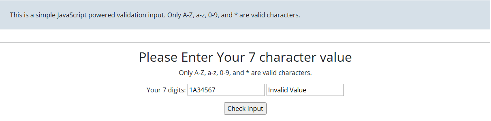

## Summary/Description ✏️
When using the character "A" in any other position than the first for any valid data returns an incorrect result.

## Steps to Reproduce ⚙️
1. Navitgate to https://testpages.eviltester.com/apps/7-char-val/
2. Enter a data set of 7 valid characters with "A" in any position other than the first
3. Click "Check Input" Button
4. Observe the application behavior.

## Expected Behavior 💭
Result should display "Valid Value"

## Actual Behavior ‼️
Result displays "Invalid Value"

## Screenshots/Visual Evidence 📷

## Environment 🌳
- **Operating System:** Windows 11
- **Browser/Version:** Google Chrome Version 145.0.7632.117

## Risks ⚠️
- **[] Critical** - Blocks all work, requires immediate fix
- **[X] Major** - Significant impact but not a showstopper
- **[] Minor** - Low impact, cosmetic issues
- **[] Trivial** - Very minor issue

## Relative Test Cases 📌
| Test Id | Description | Steps | Data | Expected Result | Actual Result | Status | Additional Information |
| :-: | :-: | :-- | :- | :-- | :-- | :- | :-- |
| 2.1 | Use exactly 7 Lower bound Capital Letters | 1. Click on character input field.  2. Provide data set.  3. Click "Check Input" button| data_set:AAAAAAA | Validation Field reads "Valid Value" | Validation Field reads "invalid Value" | Fail | Discovered that behavior is only consistance with the Character A and only occurs if A is in any other position besides the first|
| 2.10 | Use the character "A" in the first position of the input string (Test Case created for Bug #2) | 1. Click on character input field.  2. Provide data set.  3. Click "Check Input" button| data_set: A234567 | Validation Field reads "Valid Value" | Validation Field reads "Valid Value" | Pass | Due to Bug #2, Test case create to test bounds more closely and validation for Regression testing |
| 2.11 | Use the character "A" in any other position besides the first (Test Case created for Bug #2) | 1. Click on character input field.  2. Provide data set.  3. Click "Check Input" button| data_set: 1A3456A | Validation Field reads "Valid Value" | Validation Field reads "invalid Value" | Pass | Due to Bug #2, Test case create to test bounds more closely|